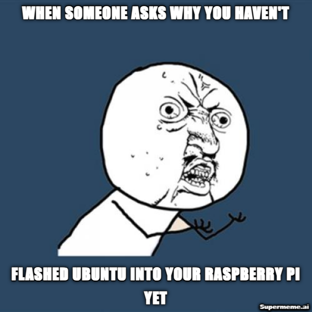

<p>
THIS IS TESTING ALL CODE HAVE NOT BE REALLY TO GO
FIXME: Have not yet tested on the RSPI. I need some people who have RSPI that have ROS to run and tell me what error code.
FIXME: THE version so far I have written is in the TEST_PWM_RSPI.py However, using TEST_led_contorl.py to test the board will be the first thing to do so far.
</p>
<p>
If you want using the TEST_PWM_RSPI.py, plase follow this guildline to help you connect the electic to IBT_2 to the RBPI
</p>


<p>
<h1><b>
Welcome to ROS for RSPI contorl mortor
</b></h1>
</p>
<p>
Created By: Houming Ge
</p>
<p>
 
 Modify: Long, Justin, 
<p> 
Version 0.6.2
</p>
<p>
This ROS package is designed for ROS Noetic to control the motor when connected to Ubuntu 20.0.xx on RSPI.
When it runs it should be a Subscriber to the Publisher. 
However, it also will be Publisher when it needs to send the state of the motor back to the higher level.
The publisher needs to have an idea this the state of the motor is only the information tag [info] it will not count as the error or warning tag.
When the higher node send the speed contol for this Node. They need to follow the style that program is provide.
</p>
<br>
<p><h2>
Writing
</h2>
Connect the IBT_2 F and R PWM pin to the PWM Pin that TEST_PWM_RSPI.py that has being signed.
 
Connect the IBT_2 F IN pin to the FDir Pin that TEST_PWM_RSPI.py that has being signed.

Connect the IBT_2 R IN pin to the RDir Pin that TEST_PWM_RSPI.py that has being signed.

Connect the IBT_2 F and R EN pin to the GND. We are not going to it.

Connect the IBT_2 5V Pin to the RBPI 5V Pin.

Connect the IBT_2 GND Pin to the Comt GND, if their are not connect it to the RBPI any GND Pin.
</p>

<p>
Under the How to install we have used the example file TEST_led_contorl.py as an example.
For TEST_led_contorl.py make sure you have an LED connected to Pin 12 on the RSPI
<br><br><h2>
<b>How to install:
</b></h2></p>

<p><s>
Install ROS Noetic on your Raspberry Pi 3B+ if you haven't already. You can follow the official installation guide for Raspberry Pi: http://wiki.ros.org/noetic/Installation/Ubuntu
</s>
---------------------

Because the ROS Noetic website is out of date. Please follow this guide for Raspberry Pi:

https://docs.google.com/document/d/1gyOpWGFm9_IUQVTmd94F3PB0bu6d0COShgGZpof6Luc/edit#heading=h.bnwaaeqj943o
</p>

Create a ROS package (if you haven't already) for your LED control project. Replace your_package_name with your desired package name:
```bash
cd ~/catkin_ws/src
catkin_create_pkg your_package_name rospy std_msgs
```
Create a Python script for controlling the LED. You can use the RPi.GPIO library to toggle GPIO pin 12. Install it if you haven't already:
```python
pip install RPi.GPIO
```
Create a Python script, e.g., led_control.py inside your ROS package's src folder:
Example is TEST_led_contorl.py

Make sure to modify the ROS package's CMakeLists.txt and package.xml files to include the necessary dependencies and build instructions.

Build your ROS package:
```bash
cd ~/catkin_ws
catkin_make
```
Before running your ROS node, make sure you've connected everything to the right GPIO pins, with an appropriate resistor and power source.

Run your ROS node:
```bash
rosrun your_package_name led_control.py
```

For the File TEST_led_contorl.py, The controls messages that can be used is show as this:
```bash
rostopic pub /led_control std_msgs/Bool "data: true"  # Turn on the LED
rostopic pub /led_control std_msgs/Bool "data: false" # Turn off the LED
```
<br><br>
<p><h2>
Message format 
</h2>
<h4>
Input Message Format
</h4>
rostopic pub /motor_control std_msgs/Int16 "data: [50, -75]"
50: 50% of the speed in forward
-75: 75% of the speed in backward

<h4>
OUTPUT Example
</h4>
[INFO] [1632772812.123456]: Motor speeds updated - Motor 1: 50%, Motor 2: -75%
 Type          ID           Text about this       Current speed  Current speed
                              information          for Motor 1    for Motor 2
</p>

<p><h1>
ISSUE
</h1>
<li>
If the Moter speed is being set to the 0 it having change it will be still going dir that was orginal going. After about 2s the Moter will be stop.
<li>
If the Moter is at Max speed (100%) and you studly change to stop status. The Motor will broken as the torke is to high to stop.
<li>

</p>
